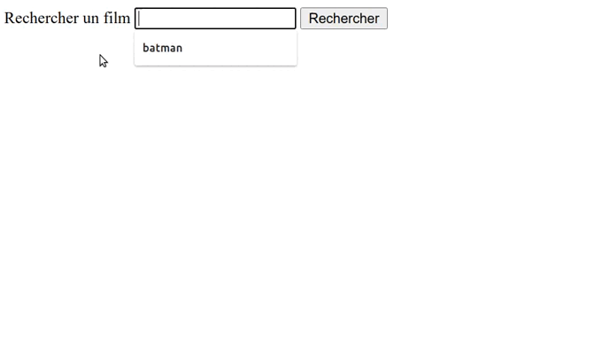
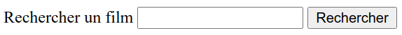
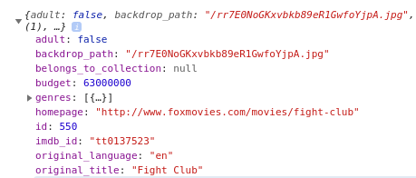
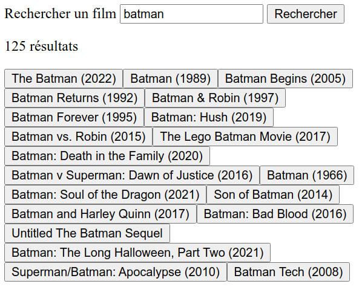
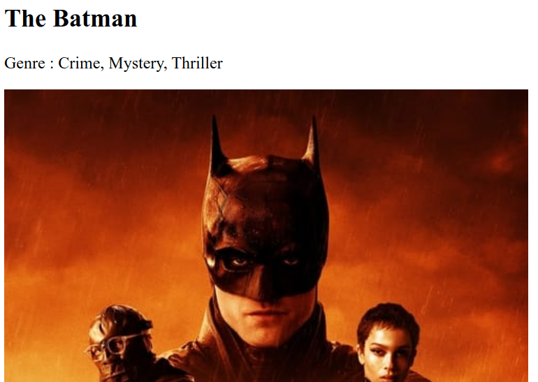

# TP : The Movie Database API

Le but de ce TP est de réaliser une page de recherche de films en utilisant l'API du site [The Movie Database](https://www.themoviedb.org/).

Voici ce que nous allons réaliser :



Dans ce TP, vous êtes libre de la structure de vos fichiers et des styles que vous ajouterez au résultat !

## Étape 0 : le formulaire

Intégrez le formulaire. Il contient :

- un champ de recherche et son label "Rechercher un film"
- un bouton de validation



Attention à la sémantique ! N'oubliez pas que :

- le champ et son label doivent être liés (c'est à dire que lorsqu'on clique sur le label, le champ est automatiquement sélectionné)
- il ne faut pas qu'on puisse valider le formulaire si le champ est vide

Enfin, commencez à ajouter du JavaScript pour récupérer, pour l'instant avec un simple `console.log`, le contenu du champ lorsque l'utilisateur clique sur `Rechercher`.

## Étape 1 - L'API

Tout d'abord, créez un compte sur [TMBD](https://www.themoviedb.org/?language=fr).

Dans vos [paramètres](https://www.themoviedb.org/settings/api?language=fr), allez récupérer votre clé API. Le champ s'appelle _API Key (v3 auth)_. Stockez cette clé dans une variable JavaScript, elle vous permettra d'utiliser l'API.

Cette page donne aussi un exemple de requête (_Example API Request_).

Directement dans la console du navigateur, utilisez cet exemple en vous inspirant du code ci-dessous pour vérifier que votre clé fonctionne.

```js
fetch("https://api.themoviedb.org/3/movie/550?api_key=XXX")
  .then((response) => response.json())
  .then((response) => console.log(response));
```

Vous devez obtenir une réponse : les détails pour le film _Fight Club_.



## Étape 2 : La recherche

Voici la [documentation de l'API](https://developers.themoviedb.org/3/getting-started/introduction).

Parcourez-là un peu : elle est très complète.

Trouvez quelle URL vous permet d'effectuer une recherche à partir d'une chaîne de caractère (souvent appelée `query`).

Il est possible de rechercher des personnes, des séries... Nous sommes ici intéressés par la recherche de films.

Grâce à votre clé API et l'URL donnée par la documentation, vous allez pouvoir mettre en place la recherche.

Lorsque l'utilisateur valide sa recherche :

- Effectuez la recherche correspondante
- Affichez le nombre de résultats (ou _"Pas de résultats"_ si il n'y en a pas)
- Affichez une liste de boutons pour les 20 premiers films retournés.
- Précisez l'année à côté du titre de chaque film



## Étape 3 : Le détail

Lorsqu'un film est retourné dans le tableau de résultat, son `id` vous est donné (pour _Fight Club_, c'est l'id `550`).

Cet `id` vous permet de faire une nouvelle requête pour obtenir le détail sur un film spécifique.

Dans la documentation, trouvez quelle URL permet d'obtenir les détails sur un film. En réalité, vous la connaissez déjà : c'était la requête de test de l'étape 1.

Lorsque l'utilisateur clique sur un bouton correspondant à un film :

- Effectuez la requête pour obtenir le détail
- Affichez le titre du film dans une balise `<h2>`
- Affichez la liste des genres associé à ce film
- Affichez l'affiche du film



Voir la documentation de l'API concernant les [images](https://developers.themoviedb.org/3/getting-started/images).

Félicitations ! Vous pouvez désormais :

- Ajouter des styles et/ou animations
- Ajouter des fonctionnalités
